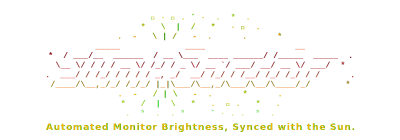
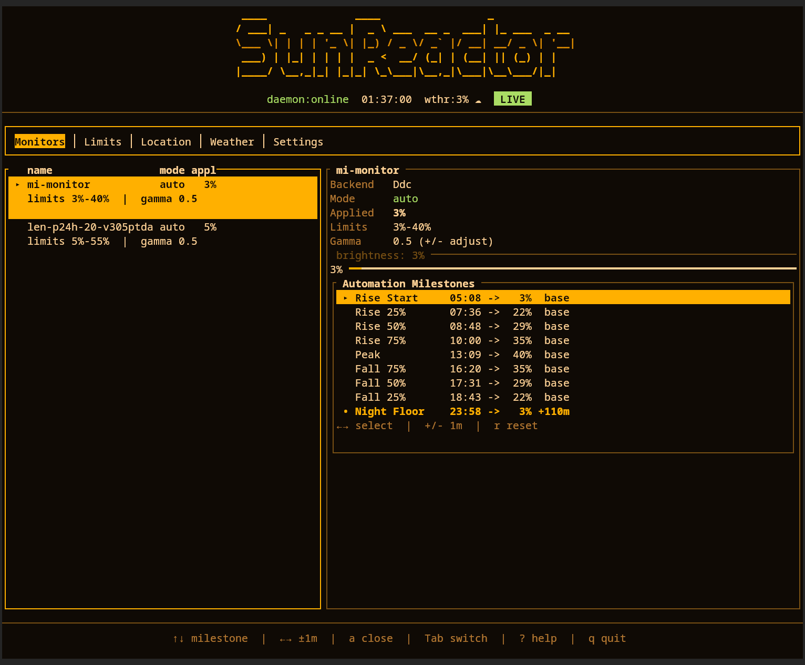
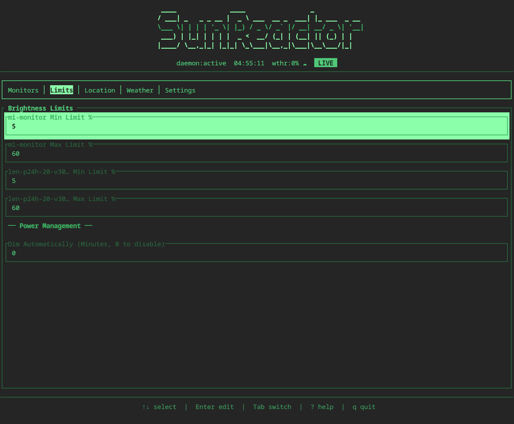
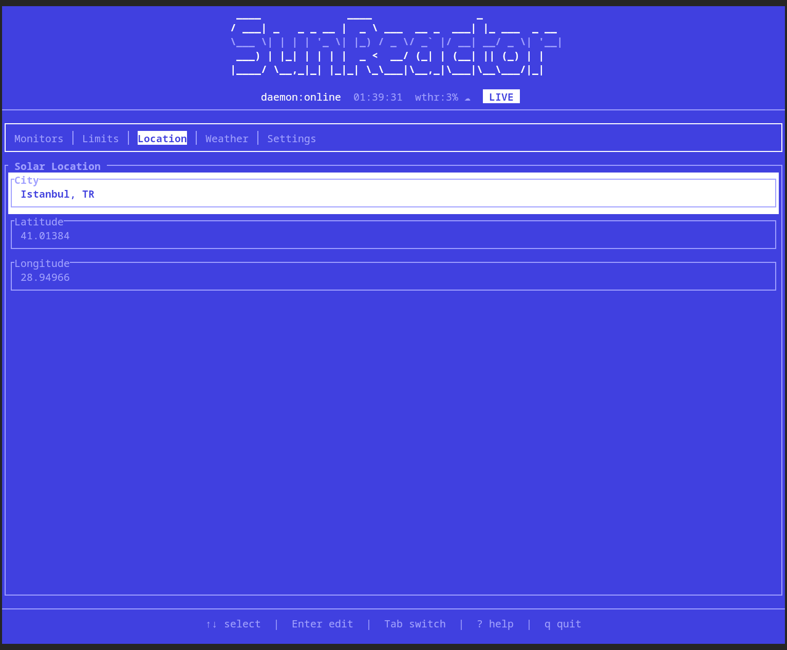
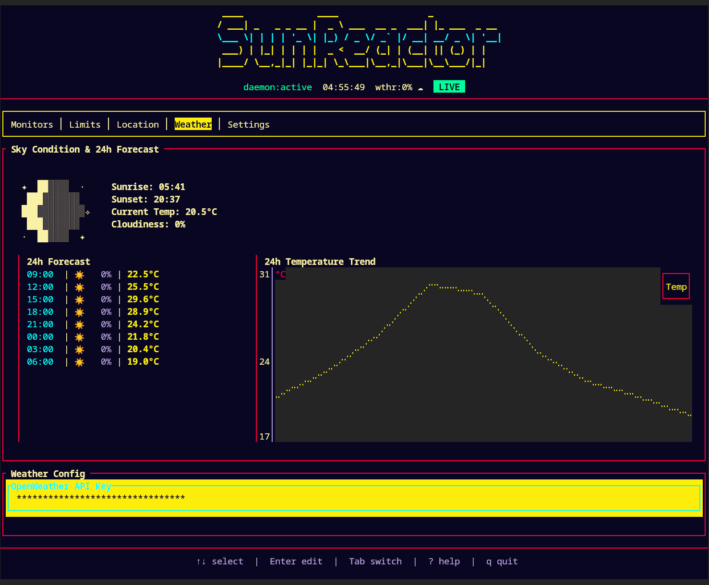
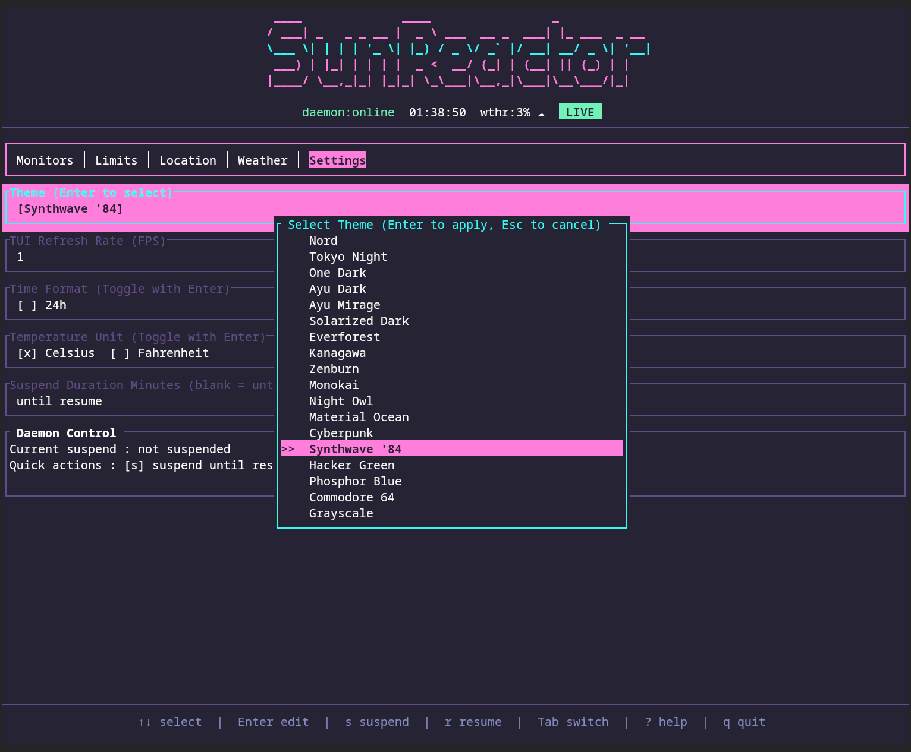

<div align="center">
  
</div>

---

**SunReactor** is a lightweight, headless Rust daemon designed to automate monitor hardware brightness. By calculating solar elevation based on your exact geolocation and time, it generates a brightness curve that adapts to seasonal daylight shifts. Combined with real-time cloudiness data from the OpenWeather API and customizable limits via a dedicated TUI, the daemon orchestrates your displays in the background.

## // PREVIEW

<div align="center">
  
  
  <br/>
  
  
  
</div>
<br/>

## // THE AUTOMATION

Static clock schedules don't adapt to seasonal daylight changes. SunReactor uses the sun's actual elevation above the horizon to calculate brightness change.

```text
        ☀ (Solar Noon) --> Max Brightness
       /  \
     /      \ (Smoothly dimming via gamma curve)
   /          \
- 0° (Horizon) ------------------------------
                \
                  \ ☾ (Night) --> Min Brightness
```

- **Built-in Cities & Custom Locations:** Pick a city from the offline database for a quick setup. Want it even more precise? Enter your exact coordinates via the TUI so the sun and cloud data match the exact sky outside your window, not just the general city area.
- **Local by Default:** SunReactor does all the daylight math locally. Getting weather data is optional. If you want cloud adjustments, the daemon will connect directly to the OpenWeather API to fetch what it needs. Turn this off, and the program remains completely offline.
- **Multi-Monitor Support:** 50% brightness on an IPS panel looks different than 50% on a VA or OLED. You can set distinct minimum, maximum, gamma curvature, and gain values for each display. The daemon calculates each monitor's brightness independently.

## // ARCHITECTURE & CONSTRAINTS

SunReactor is built to be predictable and stay out of the way:

- **Hardware Control:** Adjusts the actual backlight via `ddcutil` (external) and `sysfs` / `brightnessctl` (internal).
- **Pure Logic:** The math engine runs offline with no network calls, state mutations, or subprocesses.
- **Synchronous:** Wakes up, computes the math, writes to the hardware, and sleeps. It does not use an async runtime.
- **Unprivileged:** Runs as a systemd user service. No root access or dbus required.
- **Optional Weather:** If you provide a free OpenWeather API key, the daemon reads cloud cover and slightly dims your displays on overcast days. This acts only as a multiplier over the base calculation. Plus, it gives you an excuse to track live weather and sunrise/sunset times right in the TUI :)

## // INSTALLATION

**Dependencies:** `ddcutil` (for external displays) and `brightnessctl` (for laptops).

```bash
sudo pacman -S ddcutil brightnessctl

# Clone and build from source
git clone https://github.com/arcanorca/SunReactor.git
cd SunReactor
cargo install --path .
```

Generate the initial state and discover your connected monitors:
```bash
sunreactorctl config init
sunreactorctl discover
```

Start the daemon:
```bash
mkdir -p ~/.config/systemd/user
cp contrib/systemd/sunreactord.service ~/.config/systemd/user/

systemctl --user daemon-reload
systemctl --user enable --now sunreactord.service
```
*(Note: If installed via Cargo, ensure the `ExecStart` path in the unit file points to `%h/.cargo/bin/sunreactord`)*

## // INTERFACE & CONTROL

You can configure and monitor the daemon using the built-in terminal interface (`ratatui`). It connects to the daemon over a local IPC socket.

```bash
sunreactorctl tui
```

The TUI includes real-time monitoring, weather charts, theme options, and config management.

The CLI also provides direct commands for scripting or quick overrides:
```bash
sunreactorctl status               # View current solar state and monitor levels
sunreactorctl suspend --minutes 60 # Temporarily pause automation
sunreactorctl set desk 50          # Manually override a specific monitor
sunreactorctl clear-override       # Resume automatic solar policy
```

## // UNDER THE HOOD

The TUI writes your settings to a standard TOML file at `~/.config/sunreactor/config.toml`. Here is an example:

```toml
[location]
city = "Istanbul"
timezone = "Europe/Istanbul"

[[monitors]]
logical_id = "desk"
backend = "ddc"
min_pct = 20
max_pct = 90
gain = 1.0

[[monitors]]
logical_id = "laptop"
backend = "backlight"
min_pct = 5
max_pct = 100
gain = 1.2
sysfs_path = "/sys/class/backlight/amdgpu_bl1"

[weather]
enabled = true
provider = "openweather"
api_key_env = "OPENWEATHER_API_KEY"
```

## // DETAILS

- **Developer:** arcanorca
- **License:** GPL-3.0-or-later
- **Stack:** Rust | ratatui | systemd (user) | Unix IPC | ddcutil | brightnessctl
