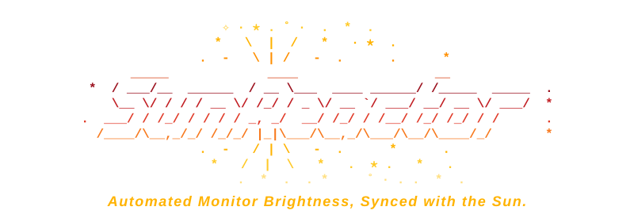
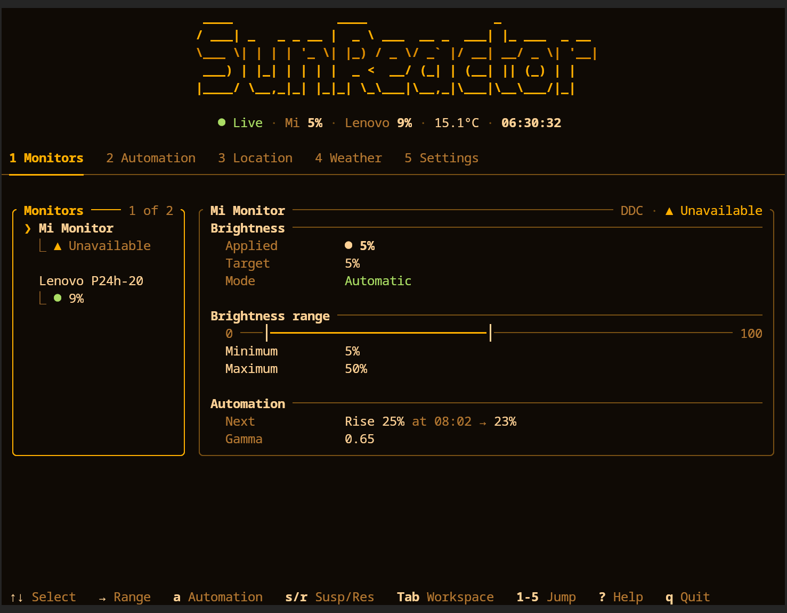
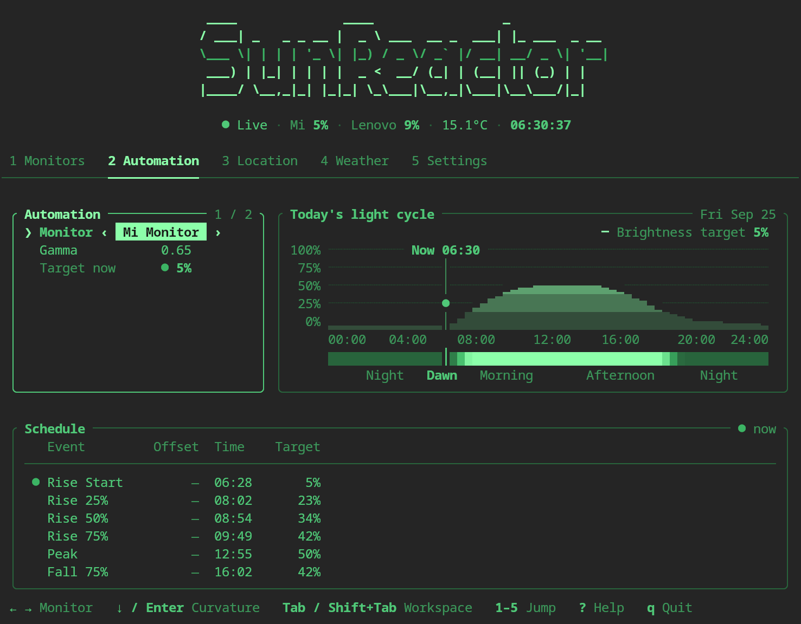
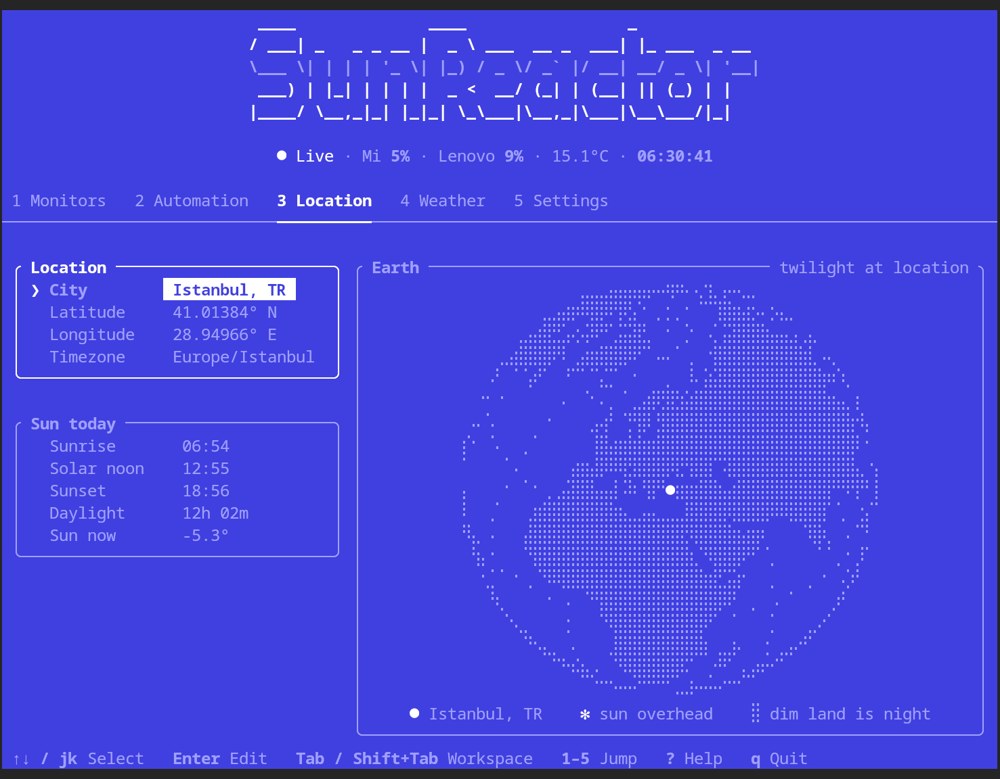
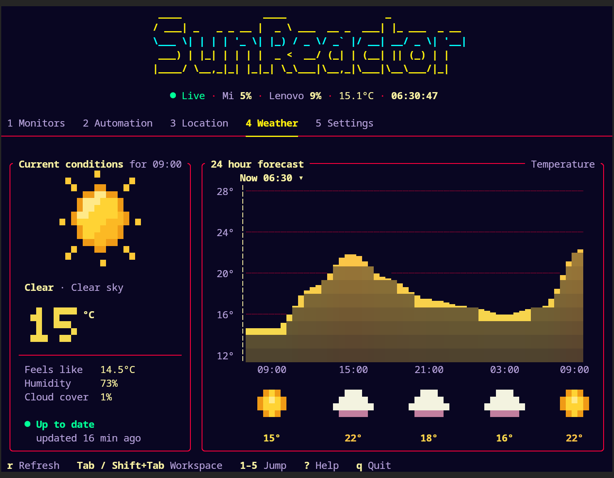
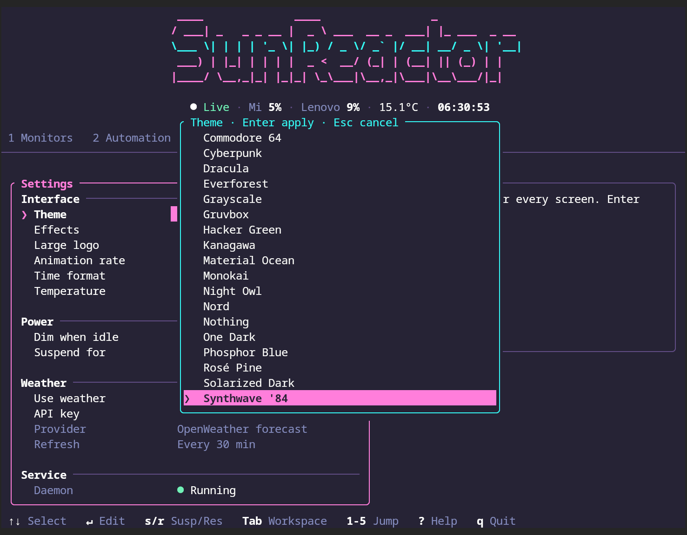

<div align="center">
  
  <br/>
  <a href="https://ratatui.rs"></a>
  
  
  
</div>

<br/>

**SunReactor** is an ultra-low overhead, deterministic hardware brightness automation engine written in pure Rust. Operating as an unprivileged background daemon, it continuously aligns display luminance with the astronomical solar elevation curve calculated for your exact geographic coordinates. The engine combines local astronomical ephemeris algorithms, bounded meteorological cloud-cover heuristics, and hardware-truth reconciliation loops to deliver jitter-free, failure-isolated backlight management across multi-display workspaces.

---

## // PREVIEW (TUI WORKSPACES & THEMES)

SunReactor features an immediate-style, terminal UI built with `ratatui` featuring 28 built-in themes, orthographic daylight globes, and real-time hardware telemetry:

<div align="center">
  
  
  <br/>
  
  
  
</div>

*Shown above: **Monitors** (Amber), **Automation & Daylight Curve** (Terminal), **Location & Orthographic Earth Globe** (Commodore 64), **24h Forecast & Solar Radiance** (Cyberpunk), and the **Theme Picker Modal** (Synthwave '84).*

---

## // WHAT'S NEW (V0.12.0 CHANGELOG HIGHLIGHTS)

SunReactor **v0.12.0** introduces critical reliability, performance, and failure-isolation engineering across the entire runtime pipeline:

- **DRM Kernel Power Gating:** Eliminates I2C driver lockouts and bus freezes. External monitor state is verified directly through kernel sysfs attributes (`/sys/class/drm/*/dpms` and `status`) before dispatching DDC commands, skipping unreachable or sleeping displays immediately.
- **Fail-Closed Monitor Wake Loop:** Resolves desynchronization caused by dropped desktop wake signals (e.g., logind/compositor churn). A deterministic 15s hardware probe schedule paired with an aggressive 60s post-wake fast-recovery window (2s cadence) forcefully re-asserts astronomical brightness over compositor-level resets.
- **Per-Device Fault Isolation & Exponential Backoff:** Isolates communication failures per physical display. Transient timeouts and missing-device faults back off independently (`5s, 10s, 20s, ... 300s`), ensuring a sluggish or disconnected monitor never stalls or delays updates on healthy displays.
- **Starvation-Free IPC Quantum:** Restricts incoming Unix domain socket traffic to a cooperative budget (max 16 requests or 8ms per daemon loop tick). Heavy client polling cannot starve or jitter smooth brightness fade animations.
- **Defended IPC Framing & Deadlines:** Strictly bounds socket communication with newline-delimited framing and a 64 KiB payload ceiling. Rigid read/write deadlines eliminate slow-read vulnerabilities and hanging socket descriptors.
- **Atomic Configuration Reloads:** Pre-validates config schema and monitor selectors before applying in-memory updates. Malformed edits trigger automatic rollbacks, and orphan monitor states are cleanly pruned.
- **Modular TUI with 28 Built-In Themes:** Re-architected into dedicated domain workspaces (`Monitors`, `Automation`, `Location`, `Weather`, `Settings`) featuring custom half-block fonts, 28 linear-blended retro color palettes, and real-time orthographic solar terminator globes.
- **Native KDE Plasma 6 Desktop Integration:** First-party QML desktop panel widget powered by a non-blocking C++ Unix domain socket client (`SunReactorClient`), adhering to KDE Human Interface Guidelines with strict mode precedence.

---

## // HARDENED SYSTEM ARCHITECTURE

SunReactor's runtime architecture is engineered around strict failure isolation, non-blocking hardware control, and zero runtime dependencies:

```text
 ┌────────────────────────────────────────────────────────────────────────┐
 │                         SunReactor Core Daemon                         │
 │                                                                        │
 │  ┌───────────────────────┐              ┌───────────────────────────┐  │
 │  │ Solar Ephemeris Math  │              │ Weather Client (Forecast) │  │
 │  │ Deterministic Curves  │              │ Bounded Attenuation Coeff │  │
 │  └───────────┬───────────┘              └─────────────┬─────────────┘  │
 │              │                                        │                │
 │              └───────────────────┬────────────────────┘                │
 │                                  ▼                                     │
 │                     ┌─────────────────────────┐                        │
 │                     │ Target Policy Evaluator │                        │
 │                     └────────────┬────────────┘                        │
 │                                  │                                     │
 │  ┌───────────────────────────────┴───────────────────────────────┐     │
 │  │         Hardware Truth Reconciliation & Probe Engine          │     │
 │  │  - DRM Sysfs Power Gate (/sys/class/drm/*/dpms, status)       │     │
 │  │  - Connector Direct Bus Addressing (Zero DDC scan bus locks)  │     │
 │  │  - Readback Verification (Prevents compositor/KWin thrashing) │     │
 │  │  - Per-Device Exponential Backoff (5s -> 300s)                │     │
 │  └───────────────┬───────────────────────────────┬───────────────┘     │
 │                  │                               │                     │
 └──────────────────┼───────────────────────────────┼─────────────────────┘
                    ▼                               ▼
       ┌────────────────────────┐      ┌─────────────────────────┐
       │ External Monitors (DDC)│      │ Internal Laptop Panels  │
       │  I2C / ddcutil bus     │      │   Linux sysfs backlight │
       └────────────────────────┘      └─────────────────────────┘
```

### 1. Hardware Truth & Fail-Closed Monitor Wake
- **DRM Kernel State Gating:** Before dispatching DDC transactions over I2C, the daemon queries connector status directly from kernel DRM attributes (`/sys/class/drm/*/status` and `dpms`). If a display is in standby, suspend, or disconnected, hardware writes are skipped immediately—eliminating I2C bus locks and timeout penalties.
- **Signal-Independent Probe Schedule:** Desktop wake notifications (e.g. logind, DRM uevents) can be dropped or skipped during compositor transitions. SunReactor implements a scheduled hardware probe loop (`runtime/wake.rs`). Every `probe_seconds` (default: 15s), the daemon directly verifies physical monitor registers.
- **Fast-Recovery Windows:** When a monitor returns from an unreachable state, a 60-second fast-probe window (2-second pulses) activates. This immediately counteracts compositor state restores (such as KWin's internal saved DDC cache) and locks the display back to the active astronomical curve.

### 2. Failure Classification & Resilient Backoff
- **Transient vs. Persistent Faults:** Hardware communication errors are isolated per monitor. Transient timeouts (busy DDC buses, hotplug debounce) and persistent device missing states are classified and tracked independently.
- **Exponential Backoff:** If a monitor fails to acknowledge a write or read, it enters per-device exponential backoff (`5s, 10s, 20s, ... 300s`). Healthy displays continue applying curve updates smoothly without being blocked or delayed by an unresponsive display.
- **Automatic Recovery:** When a degraded or disconnected monitor responds successfully, its backoff state is cleared immediately without requiring daemon restarts.

### 3. IPC Hardening & Starvation Prevention
- **Bounded Main-Loop Quantum:** The daemon IPC subsystem accepts Unix domain socket connections through a cooperative drain quantum (maximum 16 accepted requests or 8ms wall-clock duration per loop tick). Incoming IPC traffic can never starve or desynchronize the core brightness fade ticks.
- **Strict Payload Boundaries:** Every IPC message is framed with newline-delimited JSON and bounded to a strict 64 KiB payload limit. Absolute operation deadlines protect against lingering sockets and slow-read attacks.
- **Non-Destructive Socket Cleanup:** Stale socket cleanup strictly validates file metadata and active listeners, preventing accidental unlinking of foreign runtime resources.

### 4. Fail-Safe Configuration & State Pruning
- **Atomic Config Reloads:** Live configuration reloads (`sunreactorctl reload-config` or TUI writebacks) validate schema integrity, monitor IDs, and boundary constraints before updating runtime state. If validation fails, previous active configurations remain in memory.
- **Automatic Stale State Pruning:** Whenever a display is removed from `config.toml`, orphan runtime backoff trackers and monitor override state are cleanly purged during bootstrap and reload cycles.

---

## // MATHEMATICAL FORMULATION

SunReactor computes target brightness deterministically without requiring constant network connectivity:

```text
        ☀ (Solar Noon) --> Max Brightness (DayPeak)
       /  \
     /      \ (Smooth transition via parametric gamma curve)
    /        \
- 0° (Horizon) -----------------------------------------------
                \
                  \ ☾ (Astronomical Night) --> Min Brightness (NightFloor)
```

1. **Normalized Solar Position ($t$):**
   $$t = \text{clamp}\left(\frac{\theta - \theta_{\text{night}}}{\theta_{\text{day}} - \theta_{\text{night}}}, 0, 1\right)$$
   Where $\theta$ represents the instantaneous solar elevation angle calculated from the local latitude, longitude, and UTC timestamp.

2. **Smoothstep Hermite Interpolation ($s(t)$):**
   $$s(t) = t^2 (3 - 2t)$$

3. **Per-Monitor Curvature Easing:**
   $$\text{Curve}(t) = [s(t)]^\gamma$$
   Where $\gamma$ is a user-tunable easing exponent configured independently per display (`transition_gamma`).

4. **Multi-Factor Clamped Projection:**
   $$\text{Brightness}_{\text{target}} = \text{clamp}\Big(\text{MinPct} + (\text{MaxPct} - \text{MinPct}) \cdot \text{Curve}(t) \cdot \text{Gain} \cdot W_{\text{mult}}, \;\text{MinPct}, \;\text{MaxPct}\Big)$$
   Where $W_{\text{mult}} \in [0.75, 1.0]$ is the bounded cloud-cover multiplier derived from OpenWeather forecast intervals.

---

## // ECOSYSTEM & INTEGRATIONS

### 1. Interactive Terminal UI (`sunreactorctl tui`)
- Full keyboard-driven navigation with browser-style shortcuts (`1`-`5` tabs, `Tab`/`Shift+Tab`).
- Real-time ASCII light cycle and 24-hour solar trajectory visualizer.
- Interactive orthographic globe with real-time solar terminator rendering.
- 28 built-in palettes including Amber, Terminal, Commodore 64, Cyberpunk, Synthwave '84, Gruvbox, Nord, Tokyo Night, and Catppuccin Mocha.

### 2. Native KDE Plasma 6 Desktop Integration
SunReactor includes an integrated KDE Plasma 6 panel widget and C++ IPC plugin located in [`plasma/`](plasma/):
- View real-time solar elevation, current display outputs, and active weather status directly from the desktop taskbar.
- Toggle automation modes, suspend daemon adjustments, or apply manual monitor overrides without opening a terminal.

### 3. Scriptable Control CLI (`sunreactorctl`)
```bash
sunreactorctl status               # Inspect live daemon state, solar angles, and device topology
sunreactorctl discover             # Probe and identify all connected DDC and sysfs monitors
sunreactorctl set desk 75          # Apply a manual brightness override to a single monitor
sunreactorctl set --global 60      # Temporarily lock all displays to 60%
sunreactorctl suspend --minutes 90 # Pause brightness updates for 90 minutes
sunreactorctl resume               # Clear overrides and return to the active solar curve
sunreactorctl reload-config        # Atomically validate and reload config.toml
```

---

## // INSTALLATION & COMPATIBILITY

### System Requirements
- **OS:** Linux (Kernel $\ge 5.15$, glibc $\ge 2.34$ or musl) or Windows 10/11.
- **Arch / CachyOS / Fedora / Debian / Ubuntu / openSUSE** fully qualified.
- **Hardware Backends:**
  - External Displays: `ddcutil` ($\ge 1.4.1$, recommended $\ge 2.2.0$) with user access to `/dev/i2c-*` (`uaccess` or `i2c` group).
  - Laptop Panels: Linux `sysfs` or `brightnessctl`.

### Quick Automated Installation
```bash
curl -sL https://raw.githubusercontent.com/arcanorca/SunReactor/main/install.sh | bash
```

*The installer verifies SHA-256 and GitHub attestations, deploys unprivileged binaries to `~/.local/bin`, and registers a systemd user service (`sunreactord.service`).*

### Building from Source (Optimized Native Profile)
```bash
git clone https://github.com/arcanorca/SunReactor.git
cd SunReactor

# Build with maximum CPU vectorization and locked dependencies
RUSTFLAGS="-C target-cpu=native" cargo build --release --locked

# Install binaries to ~/.local/bin
install -m 755 target/release/sunreactord target/release/sunreactorctl ~/.local/bin/

# Enable user daemon
mkdir -p ~/.config/systemd/user
cp contrib/systemd/sunreactord.service ~/.config/systemd/user/
systemctl --user daemon-reload
systemctl --user enable --now sunreactord.service
```

---

## // CONFIGURATION SPECIFICATION

The daemon configuration is stored in standard TOML format at `~/.config/sunreactor/config.toml`:

```toml
[daemon]
tick_seconds = 60
dry_run = false
desktop_idle_sync = false
apply_reassert_minutes = 2
ddc_timeout_seconds = 4
probe_seconds = 15

[location]
city = "Istanbul, TR"
latitude = 41.01384
longitude = 28.94966
timezone = "Europe/Istanbul"

[solar_policy]
twilight_elevation_start = -6.0
day_elevation_full = 20.0
use_adaptive_zenith = true
max_step_pct_per_tick = 6
min_write_delta_pct = 1

[[monitors]]
logical_id = "desk-primary"
backend = "ddc"
enabled = true
min_pct = 5
max_pct = 60
gain = 1.0
transition_gamma = 0.65
connector = "card1-DP-1"

[[monitors]]
logical_id = "laptop-internal"
backend = "backlight"
enabled = true
min_pct = 2
max_pct = 100
gain = 1.1
transition_gamma = 0.5
sysfs_path = "/sys/class/backlight/amdgpu_bl1"

[weather]
enabled = true
provider = "openweather"
api_key_env = "OPENWEATHER_API_KEY"
refresh_minutes = 30
min_multiplier = 0.75

[tui]
fps = 60
theme = "amber"
effects = "instrument"
show_logo = true
```

---

## // DETAILS & LICENSING

- **Author:** [arcanorca](https://github.com/arcanorca)
- **License:** GPL-3.0-or-later
- **Core Technologies:** Rust | Ratatui | DRM Sysfs | DDC/CI (`ddcutil`) | KDE Plasma 6 QML/C++
